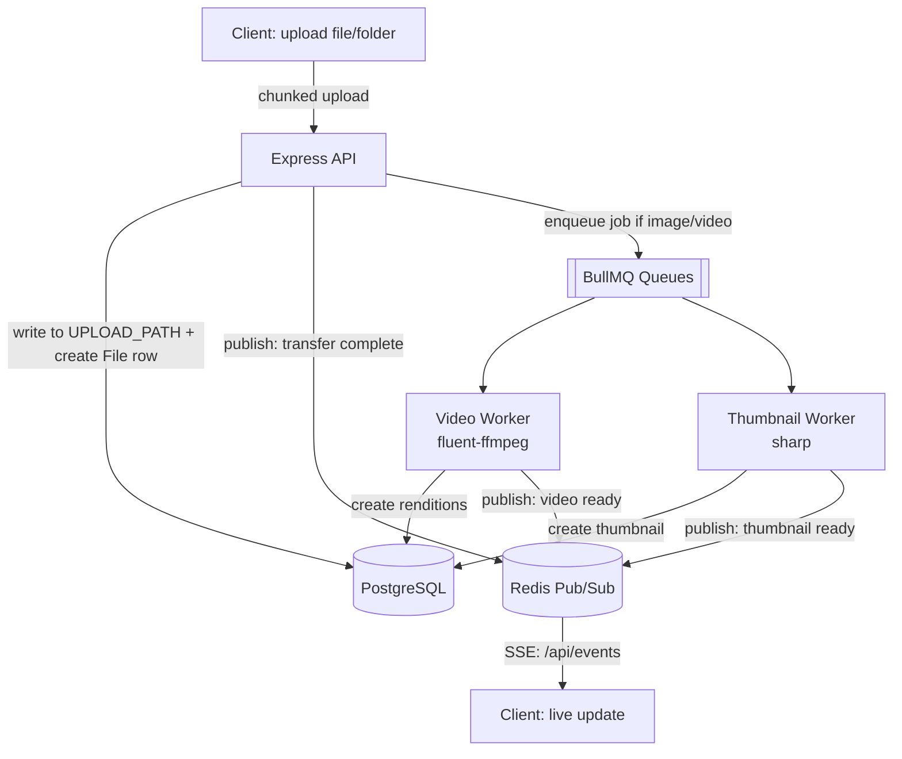
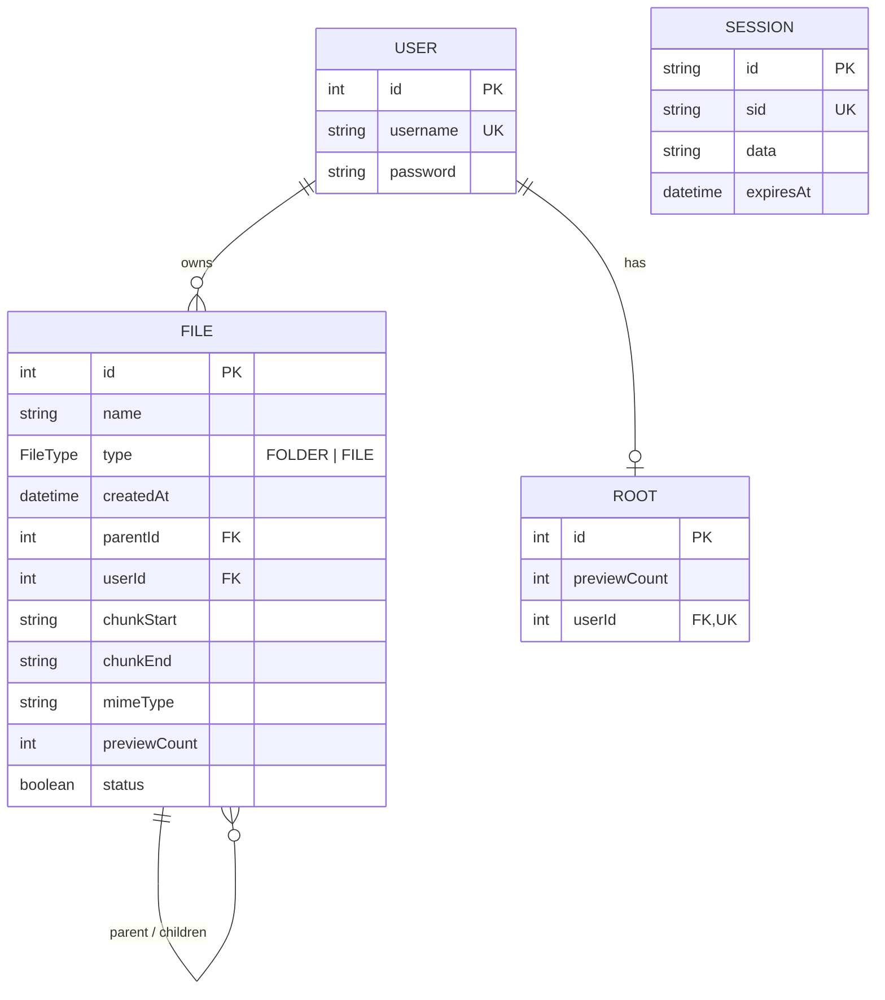

# File Uploader

A full-stack file storage and media-processing app. Users upload files/folders into a nested filesystem-like structure, with video transcoding, thumbnail generation, and live progress updates all happening asynchronously in the background.

## Features

- **Session-based authentication** — login/registration backed by Postgres-stored sessions (no JWTs)
- **Nested file & folder management** — files and folders live in a self-referencing tree
- **Concurrent uploads** — multiple uploads in flight at once, with the ability to pause or cancel a job
- **Dedicated video worker** — transcodes uploaded video into multiple resolution renditions for adaptive playback
- **Dedicated thumbnail worker** — generates preview thumbnails asynchronously, off the main request thread
- **In-browser media playback** — stream video (HLS via video.js), view images, listen to audio, all without leaving the app
- **Real-time client updates** — upload completion, video-processing completion, and thumbnail-generation completion are pushed to the client over Server-Sent Events (`/api/events`) rather than polled

## Previews
| | |
|---|---|
|  |  |
| Login | File browser |
|  |  |
| Upload in progress | Video playback |

## Tech Stack

**Frontend** — React 19, React Router 7, styled-components, video.js (+ `videojs-contrib-quality-levels`, `videojs-hls-quality-selector`, `@videojs/http-streaming` for adaptive bitrate streaming), Vite, lodash

**Backend** — Node.js, Express, Passport (`passport-local`) for auth, `express-session` + `@quixo3/prisma-session-store` for Postgres-backed sessions, Prisma ORM, Busboy/Multer for upload handling, `fluent-ffmpeg` for transcoding, `sharp` for image/thumbnail work, `archiver` for zip downloads, `bcryptjs` for password hashing

**Infrastructure** — PostgreSQL (primary datastore), Redis (BullMQ job queues + pub/sub for real-time events), Nginx (serves the frontend build and reverse-proxies the API)

> A few listed backend dependencies (`flash`, `cors`, the backend copy of `video.js`) don't have an obvious server-side role given this spec. Before deploying, it's worth confirming which are actually imported — e.g. `grep -rn "require('cors')" backend/` — and pruning the rest from `package.json`.

## Architecture

Uploads are streamed to the backend, written to disk under `UPLOAD_PATH`, and tracked in Postgres. Once a transfer finishes, a completion event is published on Redis; image/video files are then queued for further processing by their dedicated worker, which publishes its own completion event when done. The backend forwards these events to the browser over a long-lived Server-Sent Events connection (`/api/events`), so the client stays in sync without polling.



## Database Schema



`Session` has no foreign keys to the other tables — it's managed independently by `express-session` / `prisma-session-store`. `File` is self-referencing via `parentId` to model folders, with cascading deletes so removing a folder removes its contents.

## Prerequisites

These instructions assume a **fresh Ubuntu 24.04 LTS** install. Adjust package manager commands accordingly for other distros/macOS.

- Node.js 20 LTS
- PostgreSQL 16+
- Redis 7+
- ffmpeg (required by `fluent-ffmpeg`)
- Nginx
- git

## Installation

### 1. Update the system and install base tools

```bash
sudo apt update && sudo apt upgrade -y
sudo apt install -y curl git build-essential
```

### 2. Install Node.js (via NodeSource)

```bash
curl -fsSL https://deb.nodesource.com/setup_20.x | sudo -E bash -
sudo apt install -y nodejs
node -v   # confirm v20.x
```

### 3. Install PostgreSQL

```bash
sudo apt install -y postgresql postgresql-contrib
sudo systemctl enable --now postgresql
```

Create the database (use your actual Linux username as the Postgres role so `DATABASE_URL` below can match it 1:1):

```bash
sudo -u postgres psql -c "CREATE USER $USER WITH PASSWORD 'changeme';"
sudo -u postgres psql -c "CREATE DATABASE file_uploader OWNER $USER;"
```

### 4. Install Redis

```bash
sudo apt install -y redis-server
sudo systemctl enable --now redis-server
redis-cli ping   # should reply PONG
```

### 5. Install ffmpeg

```bash
sudo apt install -y ffmpeg
ffmpeg -version   # confirm install
```

### 6. Install Nginx

```bash
sudo apt install -y nginx
sudo systemctl enable --now nginx
```

### 7. Clone the repository

```bash
git clone <your-repo-url> file-uploader
cd file-uploader
```

### 8. Backend setup

```bash
cd backend   # adjust to your actual backend folder name
npm install
```

Create a `.env` file in the backend folder:

```bash
# Connects Prisma to the DB created in step 3 — replace MY_LINUX_USERNAME and <password>
DATABASE_URL="postgresql://MY_LINUX_USERNAME:<password>@localhost:5432/file_uploader?schema=public"

# Where uploaded files are written on disk — must exist and be writable by the Node process
UPLOAD_PATH="/home/MY_LINUX_USERNAME/Downloads/Uploads/"

# Domain the session cookie is scoped to. Only relevant when serving the app through
# a domain like ngrok's (see "Network access modes" below) — leave unset for LAN/IP access.
COOKIE_DOMAIN=.ngrok-free.app
```

Make sure the upload directory actually exists before starting the server:

```bash
mkdir -p "$(grep UPLOAD_PATH .env | cut -d '"' -f2)"
```

Generate the Prisma client and run migrations:

```bash
npx prisma generate
npx prisma migrate dev --name init
```

### 9. Frontend setup

```bash
cd ../frontend   # adjust to your actual frontend folder name
npm install
```

Create a `.env` file:

```bash
VITE_API_URL=/api
```

This is a **relative** path, not a full URL, because Nginx is the single entry point in this setup — it serves the built frontend *and* reverse-proxies `/api/*` to the Node backend. The browser only ever talks to Nginx on port 80; it never hits `localhost:3000` directly. Build the static frontend for Nginx to serve:

```bash
npm run build
```

This produces a `dist/` folder. Copy (or symlink) it to wherever Nginx will serve it from — the config below assumes `/usr/share/nginx/koki-drive/dist`:

```bash
sudo mkdir -p /usr/share/nginx/koki-drive
sudo cp -r dist /usr/share/nginx/koki-drive/
```

### 10. Configure Nginx

Replace the contents of `/etc/nginx/nginx.conf` with:

```nginx
worker_processes  1;

include modules.d/*.conf;

events {
    worker_connections  1024;
}

http {
    include       mime.types;
    default_type  application/octet-stream;
    sendfile        on;
    keepalive_timeout  65;

    server {
        listen       80;
        server_name  fine-endlessly-lark.ngrok-free.app;   # replace with your domain or server IP
        client_max_body_size 100M;

        root   /usr/share/nginx/koki-drive/dist;
        index  index.html index.htm;

        # Server-Sent Events stream — needs buffering/caching off and long timeouts
        # so the connection stays open instead of getting cut or chunked by Nginx.
        location /api/events {
            proxy_pass http://localhost:3000/events;
            proxy_buffering off;
            proxy_cache off;
            proxy_read_timeout 24h;
            proxy_send_timeout 24h;
            proxy_connect_timeout 24h;
            proxy_set_header Host $host;
            proxy_set_header X-Real-IP $remote_addr;
            proxy_set_header X-Forwarded-For $proxy_add_x_forwarded_for;
            proxy_set_header X-Forwarded-Proto https;
            proxy_set_header Connection '';
            proxy_set_header Accept-Encoding '';
            proxy_http_version 1.1;
        }

        # Everything else under /api -> the Express backend
        location /api/ {
            proxy_pass http://localhost:3000/;
            proxy_set_header Host $host;
            proxy_set_header X-Real-IP $remote_addr;
            proxy_set_header X-Forwarded-For $proxy_add_x_forwarded_for;
            proxy_set_header X-Forwarded-Proto https;
            proxy_cookie_domain localhost $host;
            proxy_cookie_path / /;
        }

        # React Router SPA fallback
        location / {
            try_files $uri $uri/ /index.html;
        }

        error_page   500 502 503 504  /50x.html;
        location = /50x.html {
            root   /usr/share/nginx/html;
        }
    }
}
```

`client_max_body_size 100M` raises Nginx's default upload cap so large file chunks aren't rejected — bump it further if you expect bigger uploads. `proxy_cookie_domain` rewrites the `Set-Cookie` domain the backend issues (it thinks it's `localhost`) to match whatever host the client actually requested, so the session cookie sticks.

Test the config and reload:

```bash
sudo nginx -t
sudo systemctl reload nginx
```

## Running the app

Postgres, Redis, and Nginx are already running as services from the install steps above. Start the backend API and the two background workers as separate processes (a process manager like `pm2` or systemd units is recommended so they restart on failure):

```bash
# Terminal 1 — backend API
cd backend
npm start

# Terminal 2 — video transcoding worker
cd backend
node workers/videoWorker.js     # adjust path to match your actual worker script

# Terminal 3 — thumbnail worker
cd backend
node workers/thumbnailWorker.js # adjust path to match your actual worker script
```

> The worker file paths above are placeholders — swap in whatever your video/thumbnail worker scripts are actually named once you fill in the rest of the project structure.

With Nginx already serving the built frontend and proxying `/api`, visiting `server_name` (or the machine's IP — see below) in a browser is enough; there's no separate frontend dev server to run in this setup.

### Optional: Vite dev server for frontend work

The current `vite.config.js` doesn't proxy `/api` anywhere, so running `npm run dev` as-is won't be able to reach the backend — `/api` requests will hit Vite's own dev server (port 5173) instead of Node. To use Vite's hot-reload dev server while working on the frontend, add a `server.proxy` rule pointing `/api` at the backend:

```js
import { defineConfig } from 'vite'
import react from '@vitejs/plugin-react'

export default defineConfig({
  plugins: [react()],
  server: {
    host: true,
    port: 5173,
    proxy: {
      '/api': {
        target: 'http://localhost:3000',
        changeOrigin: true,
      },
    },
  },
});
```

Note `host: true` already binds the dev server to all interfaces (not just `localhost`), so once the proxy is added, `npm run dev` is also reachable from other devices on the LAN at `http://<host-ip>:5173` — handy for testing on a phone/tablet without rebuilding. If you go this route, you'd also need `sudo ufw allow 5173/tcp` alongside the port 80 rule below.

## Network access modes

The session cookie's settings in `app.js` need to match how the app is being reached — they're not the same for a public HTTPS tunnel vs. a plain HTTP connection on your local network:

```js
const sessionMiddleware = session({
  cookie: {
    maxAge: 7 * 24 * 60 * 60 * 1000,
    sameSite: "none",   // set to "" (empty string) for LAN/NAT access
    secure: true,        // set to false for LAN/NAT access
    httpOnly: true
  },
  secret: 'a santa at nasa',   // replace with a real secret
  resave: false,
  saveUninitialized: false,
  store: new PrismaSessionStore(
    new PrismaClient(),
    {
      checkPeriod: 2 * 60 * 1000,
      dbRecordIdIsSessionId: true,
      dbRecordIdFunction: undefined,
    }
  )
});
```

### Option A — Public access via ngrok (HTTPS)

This is the default config above. `sameSite: "none"` + `secure: true` is required because the cookie crosses from the ngrok HTTPS domain, and browsers reject `SameSite=None` cookies that aren't also marked `Secure`. Keep `COOKIE_DOMAIN=.ngrok-free.app` (or whatever your tunnel's domain is) in the backend `.env`, and point the `ngrok` tunnel at port 80 (Nginx), not 3000:

```bash
ngrok http 80
```

### Option B — LAN access via IP (HTTP, no TLS)

For reaching the app from another device on your local network by IP address (no ngrok, no HTTPS), flip both cookie settings:

```js
cookie: {
  maxAge: 7 * 24 * 60 * 60 * 1000,
  sameSite: "",     // empty string
  secure: false,
  httpOnly: true
}
```

`secure: true` cookies are only ever sent over HTTPS — over plain HTTP they'd silently never reach the server, breaking login. Leave `COOKIE_DOMAIN` unset in `.env` in this mode; it's only needed for the ngrok subdomain case.

Also update the Nginx `server_name` to match (or use `_` as a catch-all):

```nginx
server_name  _;
```

**Find the host machine's LAN IP:**

```bash
hostname -I
```

**Open port 80 in the firewall** so other devices on the network can reach Nginx (port 3000 doesn't need to be opened — only Nginx is exposed; it proxies to the backend internally):

```bash
sudo ufw allow 80/tcp
sudo ufw enable      # if ufw isn't already active
sudo ufw status
```

From another device on the same network, visit `http://<host-ip>/` in a browser.

## Notes on production use

- Set `SESSION_SECRET` (the `secret` field in `app.js`), `DATABASE_URL`, and Redis credentials via real secrets management, not committed `.env` files.
- Don't reuse `'a santa at nasa'` as the session secret outside local testing.
- Consider a process manager (e.g. `pm2` or systemd units) for the API and the two workers so they restart on failure and survive reboots.
